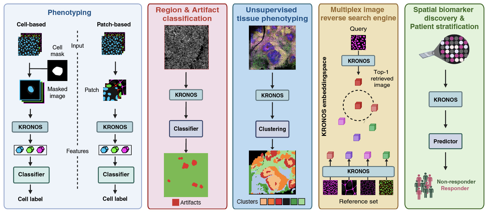

KRONOS 
===========
## A Foundation Model for Spatial Proteomics 
[`Preprint`](https://arxiv.org/abs/2506.03373) |[`Download Model`](https://huggingface.co/MahmoodLab/kronos) | [`Blog (from Shaban)`](https://www.linkedin.com/pulse/kronos-foundation-model-spatial-proteomics-muhammad-shaban-hioge/)| [`Blog (from Sizun)`](https://www.linkedin.com/pulse/spatial-proteomics-gets-foundation-model-kronos-sizun-jiang-mp0xf/)|  [`Cite`](#Reference) |  [`Namesake`](#why-is-kronos-called-kronos) <br>


**KRONOS** is a **panel-agnostic foundation model for spatial proteomics**, self-supervised on 47 million single-marker patches spanning 175 protein markers, 16 tissue types, 8 imaging platforms and 5 institutions. Its architecture couples a *shared channel-wise stem* with *sinusoidal marker-identity embeddings*, making it natively compatible with high-dimensional multiplex data.

### Key Features
* 🔬 **Biology at scale:** label-efficient cell phenotyping, unsupervised tissue phenotyping, tissue/region classification, artefact detection, patient stratification, and spatial biomarker discovery.  
* 🔎 **Spatial search engine:** drop in any cell, patch, or region of interest and KRONOS retrieves morphologically or immunologically similar areas across multi-cohort databases—supporting both exploratory and hypothesis-driven queries.  
* 🛠️ **Open resource:** pretrained weights and step-by-step notebooks/tutorials.

---

### Copyright & Licence

The KRONOS codebase and pretrained weights are released to the academic community for non-commercial academic research only. **Any commercial research use, integration into commercial products or services, or creation of derivative models (including those further trained, fine-tuned, or distilled from KRONOS) requires prior approvals.**

---

🧬 **Cell Phenotyping**  
Identify diverse cell types from multiplex marker profiles using KRONOS embeddings.  
👉 [**Tutorial: Cell Phenotyping**](https://github.com/mahmoodlab/KRONOS/blob/main/tutorials/2%20-%20Cell-phenotyping.ipynb)

---

🧩 **Patch Phenotyping**  
Classify small tissue regions based on local cellular composition — no segmentation required.  
👉 [**Tutorial: Patch Phenotyping**](https://github.com/mahmoodlab/KRONOS/blob/main/tutorials/3%20-%20Patch-phenotyping.ipynb)

---

⚠️ **Region & Artifact Detection**  
Distinguish biologically meaningful regions from technical noise or imaging artifacts.  
👉 [**Tutorial: Region & Artifact Detection**](https://github.com/mahmoodlab/KRONOS/blob/main/tutorials/4%20-%20Region-and-artifact-detection.ipynb)

---

🧠 **Unsupervised Tissue Phenotyping**  
Cluster tissue regions by shared cellular and molecular features — without labels.  
👉 [**Tutorial: Unsupervised Tissue Phenotyping**](https://github.com/mahmoodlab/KRONOS/blob/main/tutorials/5%20-%20Unsupervised-tissue-phenotyping.ipynb)

---

🔎 **Tissue Search**  
Search and retrieve tissue samples with similar phenotypic or spatial patterns using KRONOS as a spatial reverse image search engine.  
👉 [**Tutorial: Tissue Search**](https://github.com/mahmoodlab/KRONOS/blob/main/tutorials/6%20-%20Tissue-search.ipynb)

---

🧪 **Patient Stratification**  
Use KRONOS embeddings for downstream analysis such as treatment response prediction and patient subgroup discovery.  
👉 [**Tutorial: Patient Stratification**](https://github.com/mahmoodlab/KRONOS/blob/main/tutorials/7%20-%20Patient-stratification.ipynb)


<!-- 

-->

## 📢 News

### June 2025

- Initial codebase up! KRONOS model weights are now available on [HuggingFace](https://huggingface.co/MahmoodLab/kronos).

## Requirements and Access

**Hardware requirements:** KRONOS can be run on any consumer-grade GPU (e.g., NVIDIA 3090). 

**Software requirements:** KRONOS was developed and tested on Ubuntu 22.04 and Python 3.10.

**Model access:**  Request access to the KRONOS from [HuggingFace](https://huggingface.co/MahmoodLab/kronos).

## Getting Started

### Step 1. Create a virtualenv
#### Using Anaconda
``` shell
conda create -n kronos python=3.10.0
conda activate kronos
```
#### Using Python
``` shell
# for Unix/macOS
python3 -m pip install --user virtualenv
python3 -m venv kronos
source kronos/bin/activate

# for Windows
py -m venv kronos
.\kronos\Scripts\activate
```
### Step 2. Install KRONOS
``` shell
git clone https://github.com/mahmoodlab/KRONOS.git && cd KRONOS
pip install -e .

# run this command to install packages required for running tutorials
pip install -e .[tutorials]
```


### Step 3. Load KRONOS with pretrained weights
```python
from kronos import create_model, create_model_from_pretrained
model, precision, embedding_dim = create_model_from_pretrained(
    checkpoint_path="hf_hub:MahmoodLab/kronos", # Make sure you have requested access on HuggingFace
    cache_dir="./model_assets",
)

print("Model precision: ", precision)
print("Model embedding dimension: ", embedding_dim)
```

### Step 4. Process a multiplex image

We provide an example of processing a batch of dummy multiplex images with 10 markers. Refer to the tutorials for full-scale examples. 

```python
import torch
device = torch.device('cuda' if torch.cuda.is_available() else 'cpu')
model.to(device)

batch_size = 2
marker_count = 10
patch_size = 224

# generating a dummy batch with random values
batch = torch.randn(batch_size, marker_count, patch_size, patch_size).to(device)

# generating dummy mean and std values for normalization
# see marker_metadata.csv for actual mean and std values for each marker ids
mean = torch.randn(marker_count).to(device)
std = torch.randn(marker_count).to(device)

# normalizing the batch
batch = (batch - mean[None, :, None, None]) / std[None, :, None, None]

# feature extraction
with torch.no_grad():
    patch_embeddings, marker_embeddings, token_embeddings = model(batch)

print(f'Patch embeddings: {patch_embeddings.shape}')
print(f'Marker embeddings: {marker_embeddings.shape}')
print(f'Token embeddings: {token_embeddings.shape}')
```
You can now save the patch/marker/token-specific features to a npy or h5 file to use for downstream tasks.

<!-- ### Cell Phenotyping Benchmarks

Performance comparison of KRONOS, DINO-v2, UNI, and CA-MAE across cHL, DLBCL-1, and DLBCL-2 datasets. <br>
Results are reported as mean ± standard deviation over four folds. Best results per dataset and metric are in bold.

---
| Dataset | Model   | F1-Score            | Balanced Accuracy   | Average Precision   | AUROC               |
| ------- | ------- | ------------------- | ------------------- | ------------------- | ------------------- |
| cHL     | DINO-v2 | 0.5493 ± 0.0160     | 0.6210 ± 0.0121     | 0.6217 ± 0.0119     | 0.9565 ± 0.0007     |
|         | UNI     | 0.4793 ± 0.0152     | 0.5570 ± 0.0136     | 0.5348 ± 0.0136     | 0.9377 ± 0.0020     |
|         | CA-MAE  | 0.4553 ± 0.0105     | 0.5331 ± 0.0123     | 0.4950 ± 0.0181     | 0.9271 ± 0.0048     |
|         | KRONOS  | **0.6807 ± 0.0066** | **0.7358 ± 0.0089** | **0.7614 ± 0.0084** | **0.9758 ± 0.0010** |
| DLBCL-1 | DINO-v2 | 0.1932 ± 0.0316     | 0.2664 ± 0.0201     | 0.2227 ± 0.0229     | 0.6623 ± 0.0161     |
|         | UNI     | 0.4073 ± 0.0529     | 0.5077 ± 0.0333     | 0.4584 ± 0.0530     | 0.8474 ± 0.0191     |
|         | CA-MAE  | 0.3992 ± 0.0498     | 0.5041 ± 0.0314     | 0.4518 ± 0.0472     | 0.8455 ± 0.0179     |
|         | KRONOS  | **0.6669 ± 0.0492** | **0.7402 ± 0.0309** | **0.7567 ± 0.0392** | **0.9638 ± 0.0045** |
| DLBCL-2 | DINO-v2 | 0.2045 ± 0.0077     | 0.2980 ± 0.0226     | 0.2432 ± 0.0103     | 0.6938 ± 0.0194     |
|         | UNI     | 0.4295 ± 0.0164     | 0.5511 ± 0.0377     | 0.4985 ± 0.0244     | 0.8759 ± 0.0190     |
|         | CA-MAE  | 0.4231 ± 0.0185     | 0.5503 ± 0.0368     | 0.4946 ± 0.0300     | 0.8748 ± 0.0193     |
|         | KRONOS  | **0.6912 ± 0.0162** | **0.7969 ± 0.0125** | **0.8007 ± 0.0462** | **0.9759 ± 0.0023** |

--- -->


### Acknowledgements

The project was built on top of [dinov2](https://github.com/facebookresearch/dinov2) repository. We thank the authors and developers for their contributions. 

### Contact

If you have questions, comments, or concerns, feel free to email Faisal Mahmood (`faisalmahmood@bwh.harvard.edu`), Sizun Jiang (`sjiang3@bidmc.harvard.edu`) or Muhammad Shaban (`mshaban@bwh.harvard.edu`). All requests and questions will be answered in a timely manner. Immediate responses may not be available.

### Reference 

```
@article{shaban2024foundation,
  title        = {A Foundation Model for Spatial Proteomics},
  author       = {Muhammad Shaban and Yuzhou Chang and Huaying Qiu and Yao Yu Yeo and Andrew H. Song and Guillaume Jaume and Yuchen Wang and Luca L. Weishaupt and Tong Ding and Anurag Vaidya and Abdallah Lamane and Daniel Shao and Mohammed Zidane and Yunhao Bai and Paige McCallum and Shuli Luo and Wenrui Wu and Yang Wang and Precious Cramer and Chi Ngai Chan and Pierre Stephan and Johanna Schaffenrath and Jia Le Lee and Hendrik A Michel and Caiwei Tian and Cristina Almagro-Perez and Sophia J. Wagner and Sharifa Sahai and Ming Y. Lu and Richard J. Chen and Andrew Zhang and Mark Edward M Gonzales and Ahmad Makky and Joey Lee and Hao Cheng and Maximilian Haist and Darci Phillips and Yuqi Tan and Garry P Nolan and W. Richard Burack and Jacob D Estes and Jonathan T.C. Liu and Toni K Choueiri and Neeraj Agarwal and Marc Barry and Scott J Rodig and Long Phi Le and Georg Gerber and Christian M. Schürch and Fabian J. Theis and Youn H Kim and Joe Yeong and Sabina Signoretti and Brooke Howitt and Lit-Hsin Loo and Qin Ma and Sizun Jiang and Faisal Mahmood},
  year         = {2025},
  note         = {Preprint},
  howpublished = {\url{https://arxiv.org/abs/2506.03373}},
}
```
### Why is Kronos called Kronos? 

In case you were wondering: No, KRONOS is not a nod to the [1954 alien-robots-from-space movie.](https://en.wikipedia.org/wiki/Kronos_(film)) We borrowed the name from the Kronosaurus, the Early Cretaceous marine reptile that could reach 10–11 meters in length. Fewer than a dozen reasonably complete Kronosaurus specimens have ever been excavated, and one of the best-known mounts hangs in the [Harvard Museum of Comparative Zoology](https://www.thecrimson.com/article/2019/11/7/kronostory/). So yes, our model is literally named after a Harvard dinosaur. See more [here](https://www.thecrimson.com/article/2019/11/7/kronostory/).


