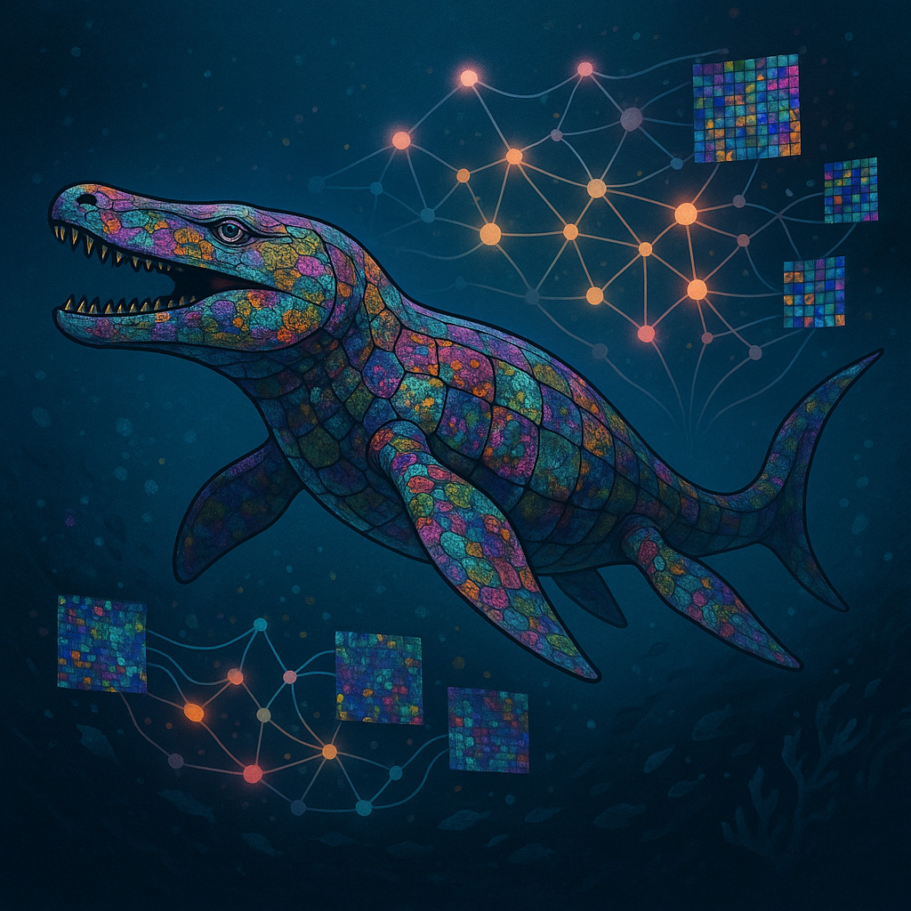

KRONOS 
===========
## Foundation Model for Multiplexed Spatial Proteomic Images
[[`Model`](https://huggingface.co/MahmoodLab/kronos)] |  [[`Paper`](#[reference])] |  [[`Cite`](#reference)]
### What is KRONOS?
KRONOS is a foundation model for encoding multiplex spatial proteomic images. Trained on a large dataset containing over 47 million patches, KRONOS captures spatial expression patterns of different proteins within multiplex images.

### Why use KRONOS?
KRONOS is designed to encode spatial expression patterns of different proteins in a given multiplex image. This makes KRONOS suitable for transfer learning to a wide range of tasks, for (1) cell phenotyping, (2) region classification, (3) artifact detection, (4) unsupervised tissue tissue phenotyping, and (5) patient stratification. 

### What is the purpose of this repository?
This repository provides tools to extract pretrained embeddings from multiplex image patches using KRONOS model.

<!-- ## Model Overview

<p align="center">
     <br>

  *Overview of THREADS model architecture*

</p> -->

## 📢 News

### May 2025

- Initial codebase up! KRONOS model weights are now available on [HuggingFace](https://huggingface.co/MahmoodLab/kronos).

## Requirements

**Hardware requirements:** We recommend running KRONOS on a consumer-grade GPU (e.g., NVIDIA 3090.) or above. 

**Software requirements:** KRONOS was developed and tested on Ubuntu 22.04 and Python 3.10. KRONOS rely on the following packages:
- `numpy`
- `torch`
- `xformers`

Furthermore, you must request access to the KRONOS model from Hugging Face. Please request access here: [HuggingFace](https://huggingface.co/MahmoodLab/kronos).

### Step 1. Create a virtualenv
#### Using Anaconda
``` shell
conda create -n kronos python=3.10.0
conda activate kronos
```
#### Using Python
``` shell
# for Unix/macOS
python3 -m pip install --user virtualenv
python3 -m venv kronos
source kronos/bin/activate

# for Windows
py -m venv kronos
.\kronos\Scripts\activate
```
### Step 2. Install KRONOS
``` shell
git clone https://github.com/mahmoodlab/KRONOS.git
pip install -e ./KRONOS

# run following command to install packages required for running the tutorials
pip install -r requirements.txt
```


### Step 3. Load KRONOS with pretrained weights
```python
from kronos import create_model, create_model_from_pretrained
model, precision, embedding_dim = create_model_from_pretrained(
    checkpoint_path="hf_hub:MahmoodLab/kronos", # Make sure you have requested access on HuggingFace
    cache_dir="./model_assets",
)

print("Model precision: ", precision)
print("Model embedding dimension: ", embedding_dim)
```

### Step 4. Process a multiplex images
Here we provide an example of how to process a batch of dummy multiplex images with 10 markers.
```python
import torch
device = torch.device('cuda' if torch.cuda.is_available() else 'cpu')
model.to(device)

batch_size = 2
marker_count = 10
patch_size = 224

# generating a dummy batch with random values
batch = torch.randn(batch_size, marker_count, patch_size, patch_size).to(device)

# generating dummy mean and std values for normalization
# see marker_metadata.csv for actual mean and std values for each marker ids
mean = torch.randn(marker_count).to(device)
std = torch.randn(marker_count).to(device)

# normalizing the batch
batch = (batch - mean[None, :, None, None]) / std[None, :, None, None]

# feature extraction
with torch.no_grad():
    patch_embeddings, marker_embeddings, token_embeddings = model(batch)

print(f'Patch embeddings: {patch_embeddings.shape}')
print(f'Marker embeddings: {marker_embeddings.shape}')
print(f'Token embeddings: {token_embeddings.shape}')
```
You can now save the patch/marker/token features to a npy or h5 file to use for downstream tasks.

### Cell Phenotyping Benchmarks

Performance comparison of KRONOS, DINO-v2, and UNI across cHL, DLBCL-1, and DLBCL-2 datasets. 

| Dataset  | Model    | F1-Score | Balanced Accuracy | Average Precision | ROC AUC |
|----------|---------|-----------|------------------|-------------------|---------|
|          | DINO-v2 | 0.5493 ± 0.0160 | 0.6210 ± 0.0121 | 0.6217 ± 0.0119 | 0.9565 ± 0.0007 |
| **cHL**  | UNI     | 0.4793 ± 0.0152 | 0.5570 ± 0.0136 | 0.5348 ± 0.0136 | 0.9377 ± 0.0020 |
|          | KRONOS  | **0.6807 ± 0.0066** | **0.7358 ± 0.0089** | **0.7614 ± 0.0084** | **0.9758 ± 0.0010** |
|          | DINO-v2 | 0.1932 ± 0.0316 | 0.2664 ± 0.0201 | 0.2227 ± 0.0229 | 0.6623 ± 0.0161 |
|**DLBCL-1**| UNI     | 0.4073 ± 0.0529 | 0.5077 ± 0.0333 | 0.4584 ± 0.0530 | 0.8474 ± 0.0191 |
|          | KRONOS  | **0.6669 ± 0.0492** | **0.7402 ± 0.0309** | **0.7567 ± 0.0392** | **0.9638 ± 0.0045** |
|          | DINO-v2 | 0.2045 ± 0.0077 | 0.2980 ± 0.0226 | 0.2432 ± 0.0103 | 0.6938 ± 0.0194 |
|**DLBCL-2**| UNI     | 0.4295 ± 0.0164 | 0.5511 ± 0.0377 | 0.4985 ± 0.0244 | 0.8759 ± 0.0190 |
|          | KRONOS  | **0.6912 ± 0.0162** | **0.7969 ± 0.0125** | **0.8007 ± 0.0462** | **0.9759 ± 0.0023** |

### Acknowledgements

The project was built on top of [dinov2](https://github.com/facebookresearch/dinov2) repository. We thank the authors and developers for their contributions. 

### Contact

If you have questions, comments, or concerns, feel free to email Faisal Mahmood (`faisalmahmood@bwh.harvard.edu`) or Muhammad Shaban (`mshaban@bwh.harvard.edu`). All requests and questions will be answered in a timely manner. Immediate responses may not be available.


